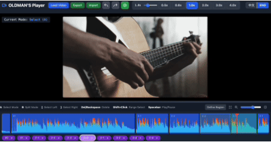
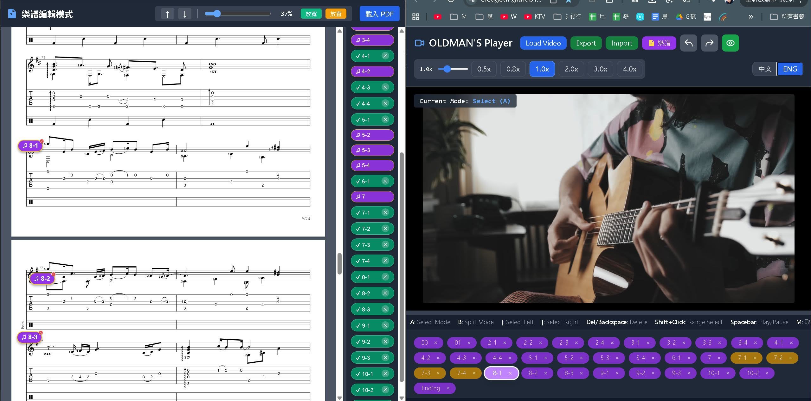

  
  

# OLDMAN'S Instrument Practice Player (老人的樂器練習播放器)

 

<h2 style="display: inline-block; cursor: pointer;">🇹🇼 繁體中文 (點擊收合 / 展開)</h2>

「老人的播放器」是一款專為音樂及歌唱學習者量身打造的輕量化、高效能網頁版影片工具。

本專案源於一個真實的困擾：在練習複雜的樂曲（如指彈吉他）時，傳統影片平台的限制。無論是想反覆練習一段 5 秒鐘的過門、在不影響音質的情況下放慢速度，或是視覺化觀察節奏，YouTube 等平台都難以滿足需求。這款播放器透過在瀏覽器中直接提供非線性剪輯 (NLE) 的時間軸體驗，徹底解決了這些痛點。

## 🚀 Live Demo

[### 👉 點我開始使用 ###](https://eledgetw.github.io/OLDMAN_PLAYER/)

## 📖 使用方式教學 (Quick Start)

1. **載入檔案 (支援拖曳)**：直接將您的練習影片、PDF 樂譜，或之前存檔的 `.json` 專案檔拖曳到瀏覽器視窗中即可載入。
2. **建立練習區段**：在時間軸上的影片片段「雙擊滑鼠左鍵」，或是使用 `Shift + 點擊` 框選範圍，即可命名並建立「自定義區間」（下方會產生紫色按鈕）。
3. **同步 PDF 樂譜**：點擊右上角的「樂譜」按鈕開啟新視窗。將下方的「紫色區間按鈕」直接**拖曳**到 PDF 樂譜上的對應位置，即可建立互動錨點。
4. **雙向跳轉播放**：點擊 PDF 上的錨點，影片會自動跳轉並播放該段落；點擊下方的區間按鈕，樂譜也會自動滑動到對應的錨點位置。
5. **儲存進度**：按下 `Ctrl + S` 即可將目前的影片剪輯狀態、區段標籤與樂譜錨點全部匯出成 `.json` 存檔，下次拖曳進來即可無縫接軌練習。

## 🌟 全新功能 (New Features)

* **📄 智慧樂譜同步系統**：支援載入 PDF 樂譜。您可以將定義好的練習區塊（A/B 段）直接拖曳到樂譜上建立錨點，實現「看譜點擊自動跳轉影片」以及「點擊區段樂譜自動跟隨」的完美雙向同步。
* **📱 完美支援 iPad 與觸控裝置**：針對行動裝置最佳化。支援 PDF 雙指縮放 (Pinch-to-zoom)、時間軸手勢滑動，並內建 iOS 專屬的 FFmpeg 音訊解析引擎，確保在 iPad 上也能順暢提取波形。
* **✨ 人性化 UI 與動態佈局**：支援全域拖曳匯入（影片、JSON、PDF 一次拖入即可）、自由上下拖曳調整編輯區高度、大字體的變速與播放狀態提示（Toast），讓您的視線不用離開樂器。

## 🚀 核心功能

* **智慧區段標記**：直接雙擊任何片段定義區間，或切割 A/B 段落。
* **精準循環播放**：支援無限循環播放特定選取範圍，強化肌肉記憶。
* **視覺化節奏感**：渲染高解析度音訊波形（最高達 15,000 個採樣點），具備**峰值顏色漸變**。
* **變速不變調**：支援 **0.1x 至 4.0x** 速度調整。
* **虛擬播放引擎**：支援非連續時間軸，遇空隙自動黑屏靜音，模擬專業剪輯軟體。
* **物理防撞拖拽**：移動片段時具備自動防撞偵測，確保軌道不重疊。
* **可拖拽區間管理**：下方自定義區間支援**滑鼠拖拽排序**。
* **完善的復原系統**：支援全域 Undo/Redo（`Ctrl+Z` / `Ctrl+Y`）。

## 🛠 影片規格建議

由於播放器需在本地解碼音訊以產生波形，效能表現取決於瀏覽器的記憶體：
* **建議長度**：30 分鐘以內。
* **建議大小**：500MB 以內。

## ⌨️ 快捷鍵

| 按鍵 | 功能 |
| :--- | :--- |
| **Space (空白鍵)** | 播放 / 暫停 |
| **A / B** | 切換 **選取模式 (A)** 與 **分割模式 (B)** |
| **\` (倒引號)** | 針對選取片段快速定義區間 (命名標籤) |
| **雙擊片段** | 自動啟動「定義區間」並輸入名稱 |
| **Enter** | 一鍵填滿 (適應螢幕) |
| **[ / ]** | 全選播放頭以左 / 以右的所有片段 |
| **方向鍵 ← / →** | 在已定義的區間標籤間快速跳轉 |
| **Ctrl/Cmd + 方向鍵** | 左右交換區間標籤的排序順序 |
| **+ / -** | 微調播放速度 (±0.1x) |
| **1, 2, 3, 4** | 常用倍速切換 (1x, 2x, 3x, 4x) |
| **5, 8** | 慢動作預設 (0.5x, 0.8x) |
| **Ctrl/Cmd + Z / Y** | 復原 (Undo) / 重做 (Redo) |
| **Ctrl/Cmd + S / L** | 快速匯出專案 / 快速匯入專案 |

 

<h2 style="display: inline-block; cursor: pointer;">🇺🇸 English (Click to expand / collapse)</h2>

OLDMAN'S Player is a lightweight, high-performance, browser-based video tool specifically engineered for music and vocal learners. 

The project was born out of a real-world frustration: the struggle of mastering complex musical pieces, such as fingerstyle guitar arrangements. Traditional video platforms like YouTube make it incredibly difficult to focus on a specific 5-second riff, slow down the tempo without losing audio clarity, or visualize the rhythm of a percussive technique. This player solves those pain points by providing a non-linear timeline (NLE) experience directly in your browser.

## 🚀 Live Demo

[### 👉 Click Here to Start ###](https://eledgetw.github.io/OLDMAN_PLAYER/)

## 📖 How to Use (Quick Start Guide)

1. **Load Files (Drag & Drop)**: Simply drag and drop your practice video, PDF sheet music, or a previously saved `.json` project file directly into the browser window.
2. **Create Practice Regions**: Double-click any video clip on the timeline, or use `Shift + Click` to select a range, to name and create a "Custom Region" (a purple button will appear at the bottom).
3. **Sync Sheet Music**: Click the "Sheet Music" button at the top right to open a new window. **Drag and drop** the purple region buttons onto the corresponding measures on your PDF sheet music to create interactive anchors.
4. **Bi-directional Navigation**: Click an anchor on the PDF to instantly jump to and play that video segment. Click a region button at the bottom of the player, and the sheet music will automatically scroll to the corresponding anchor.
5. **Save Your Progress**: Press `Ctrl + S` to export your current video edits, region labels, and sheet music anchors as a `.json` file. Drag it back in next time to pick up exactly where you left off.

## 🌟 New Features

* **📄 Smart Sheet Music Sync**: Load PDF sheet music and drag your defined practice regions directly onto the pages to create anchors. Enjoy seamless bi-directional syncing: click the sheet music to control the video, or click the video timeline to scroll the sheet music.
* **📱 Full iPad & Touch Support**: Optimized for mobile and tablet devices. Features include two-finger pinch-to-zoom for PDFs, touch-friendly timeline scrubbing, and a dedicated FFmpeg audio engine for iOS to ensure smooth waveform extraction.
* **✨ Humanized UI & Dynamic Layout**: Supports universal drag-and-drop imports (load video, JSON, and PDF all at once), an adjustable workspace (drag the separator to resize the timeline), and large visual toast indicators for speed changes and playback status so you never have to take your eyes off your instrument.

## 🚀 Core Features

* **Intelligent Segmenting**: Double-click to define a region or split clips into A/B sections.
* **Precision Looping**: Infinite looping for selected ranges to build muscle memory.
* **Visual Rhythm**: High-resolution audio waveform (up to 15,000 samples) with **Peak Color Gradients**.
* **Variable Speed Control**: Slow down from **0.1x to 4.0x** without changing the pitch.
* **Virtual Play Engine**: Automatically mutes and shows a black screen on empty timeline gaps.
* **Anti-Collision Dragging**: Built-in collision detection prevents clips from overlapping.
* **Draggable Region Management**: Reorder saved practice regions via drag-and-drop.
* **Undo/Redo System**: Full state history (`Ctrl+Z` / `Ctrl+Y`).

## 🛠 Video Guidelines

Because the player decodes audio data locally to generate waveforms, performance is tied to your browser's memory:
* **Recommended Length**: Under 30 minutes.
* **Recommended File Size**: Under 500MB.

## ⌨️ Hotkeys

| Key | Action |
| :--- | :--- |
| **Space** | Play / Pause |
| **A / B** | Switch between **Select** and **Split** modes |
| **\` (Backtick)** | Define Region for selected clip |
| **Double-Click Clip** | Instantly name and define a region |
| **Enter** | Zoom to Fit |
| **[ / ]** | Select all clips to the Left / Right of the playhead |
| **Arrow Left / Right** | Navigate between defined regions |
| **Ctrl/Cmd + Arrow** | Reorder current region label (Move Left/Right) |
| **+ / -** | Fine-tune playback speed (±0.1x) |
| **1, 2, 3, 4** | Instant speed presets (1x, 2x, 3x, 4x) |
| **5, 8** | Slow-motion presets (0.5x, 0.8x) |
| **Ctrl/Cmd + Z / Y** | Undo / Redo |
| **Ctrl/Cmd + S / L** | Quick Save (Export) / Quick Load (Import) |

---

## 🧋 Support This Project

✨ 喜歡這個專案嗎？ / Love this project? ✨

如果這個工具節省了您的時間 ⏱️ 或對您的練習有所啟發 💡，
歡迎點擊下方圖示請我喝一杯珍珠奶茶！
If this tool saved you time or inspired your practice, consider buying me a boba!

  

←←(點擊珍奶圖示支持作者 / Click the boba to support)
